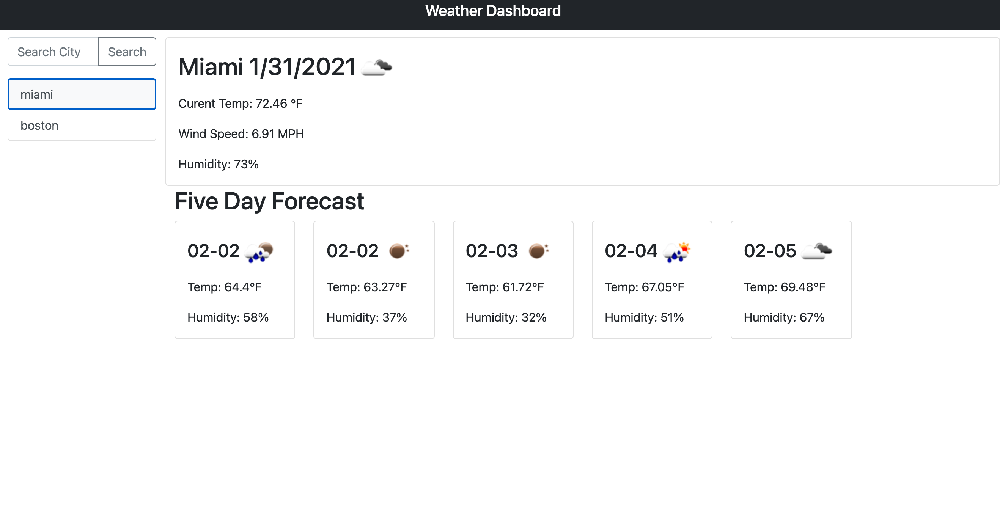
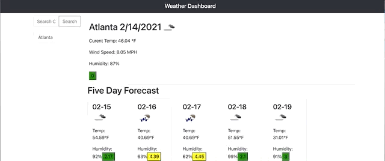

# weather-checker

  

## Write-Up
I started off this project really wanting to generate everything with jQuery. It didn't work out. I ended up using HTML and some bootstrap elements to make everything look nice. I'm not sure why this seemed so much more difficult than the last project in terms of generating elements. 

That being said, working with the API felt pretty straight forward in comparison to dealing with my jQuery generating issues. I think, after spending a lot more time with this, that I could go back and refactor it now to generate the elements I want. 

I don't feel like working with this particular API was too onerous. I like dealing with the arrays, all that makes sense. On the last homework, Stanley (instructor) gave me some great tips for working in the console that really helped me out this time. He also showed me to always hardcode everything first, and then figure out how to iterate. I've been pretty successful with that strategy. 

I'd say one of the reasons this homework was so time consuming was because of the very roundabout way I built my functions at first. I had to make a few API calls and I knew that they all needed similar or the same information, but the way I had written my first API call I had scope problems. I had functions wrapped in functions and it was very dry. It probably wouldn't have mattered that much that I had functions wrapped in functions, but I really wanted to add a keyprees() event so that if you hit the enter key, then it would search. Just like I feel like a regular website should. 

It was actually a pretty straight forward fix once I understood what my issue was. I needed to pass parameters to my funcitons, instead of relying on scope to make it work. Viola! Problem solved. I didn't have to have functions wrapped in functions and my code became a lot less dry.

## Technologies Used
[OpenWeather API](https://openweathermap.org/api)  
jQuery  
Javasctipt  
[Bootstrap](https://getbootstrap.com/)  

## Deployed Site
[Repo](https://github.com/a-andres1/weather-checker)
[Site](https://a-andres1.github.io/weather-checker/)

## License
MIT License

Copyright (c) 2021 a-andres1

Permission is hereby granted, free of charge, to any person obtaining a copy
of this software and associated documentation files (the "Software"), to deal
in the Software without restriction, including without limitation the rights
to use, copy, modify, merge, publish, distribute, sublicense, and/or sell
copies of the Software, and to permit persons to whom the Software is
furnished to do so, subject to the following conditions:

The above copyright notice and this permission notice shall be included in all
copies or substantial portions of the Software.

THE SOFTWARE IS PROVIDED "AS IS", WITHOUT WARRANTY OF ANY KIND, EXPRESS OR
IMPLIED, INCLUDING BUT NOT LIMITED TO THE WARRANTIES OF MERCHANTABILITY,
FITNESS FOR A PARTICULAR PURPOSE AND NONINFRINGEMENT. IN NO EVENT SHALL THE
AUTHORS OR COPYRIGHT HOLDERS BE LIABLE FOR ANY CLAIM, DAMAGES OR OTHER
LIABILITY, WHETHER IN AN ACTION OF CONTRACT, TORT OR OTHERWISE, ARISING FROM,
OUT OF OR IN CONNECTION WITH THE SOFTWARE OR THE USE OR OTHER DEALINGS IN THE
SOFTWARE.

[License](LICENSE)  

## Contact Info
[email me](mailto:alyssaandres1@gmail.com)  
[find me on github](https://github.com/a-andres1)

## Notes
You'll find what I've dubbed my "graveyard of failed code" at the end of my javascript page. I wanted to keep elements that I was hoping I'd be able to come back for. It hasn't worked out for me to come back to it so far, but I won't rule out the possibility.  

